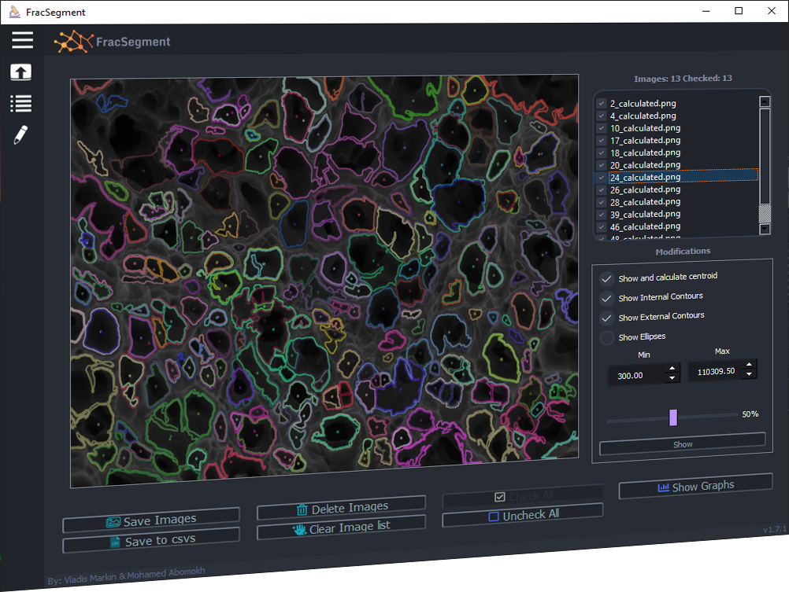
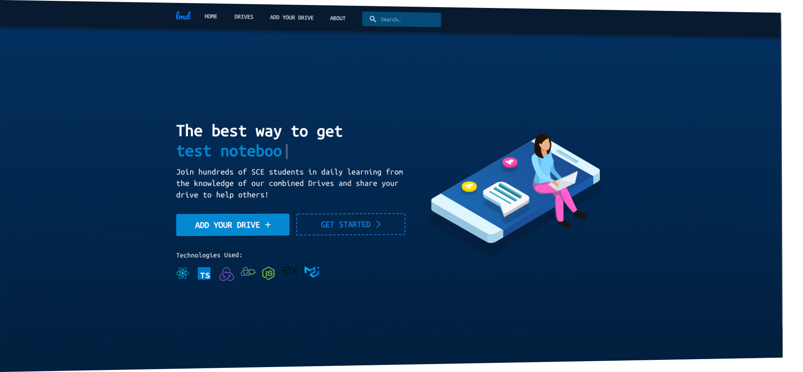
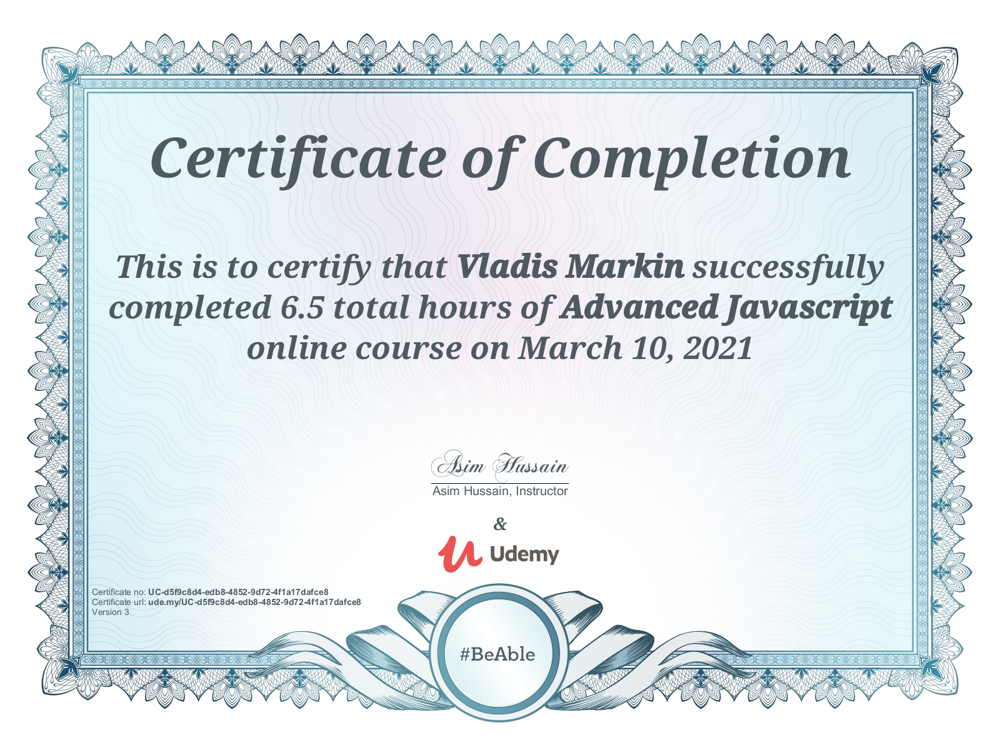
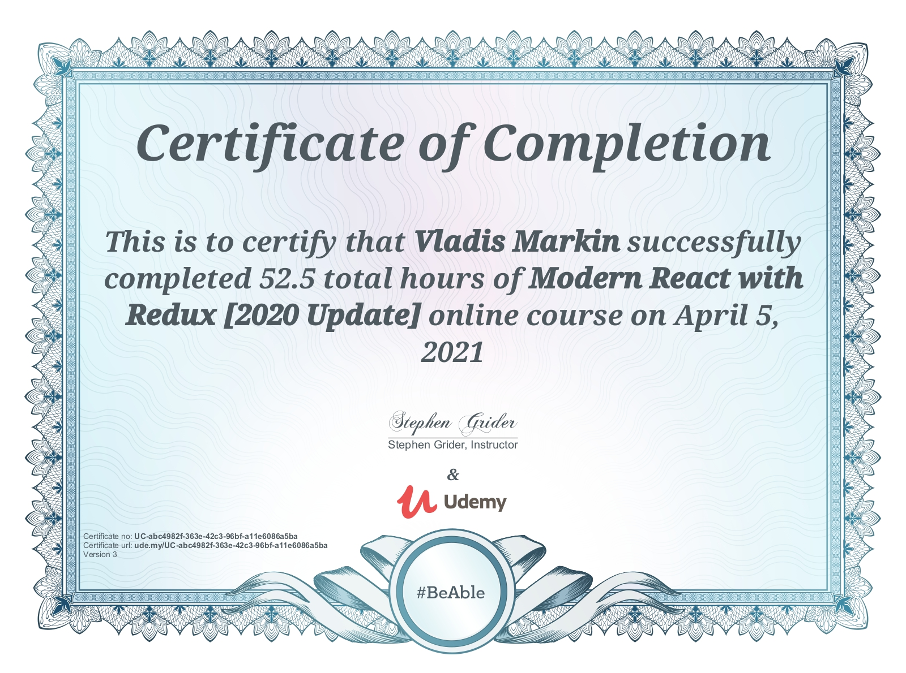
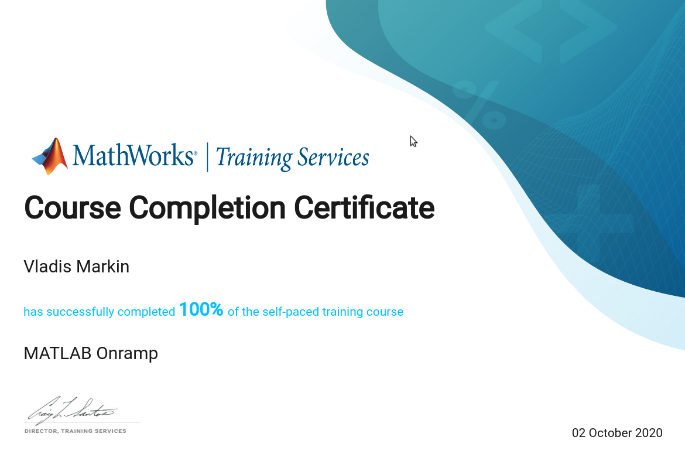
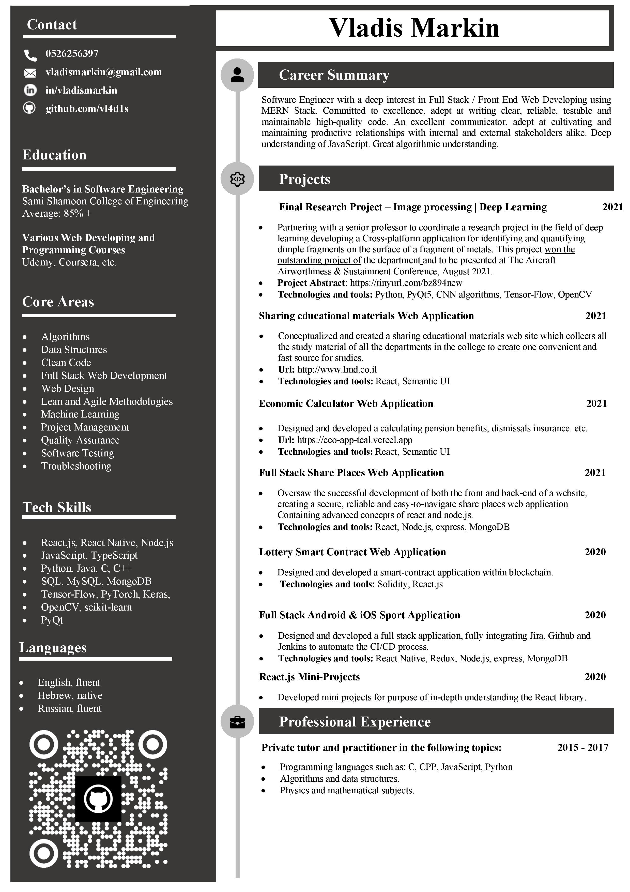

  
  ### About me:
  

I am a driven professional with an international background and a previous achievement record in sales 📈, currently pursuing my Bachelor’s in Software Engineering 👨‍🎓. My studies and project experience allowed me to hone a wealth of skills across the SDLC, as I was immersed in the planning, analysis, design, testing, implementation and maintenance of various systems, tools and products, both as part of my degree and independently. In this sense, I developed a passion for writing clean high-quality code. Currently, I am immersed in Full-Stack Web Developing 💻, ML/AI and I am working on my final project 🔬.

---

### 🔬 About my final froject:

In our research project [My Partner](https://github.com/Mohamab29) (Mohamed Nedal Abomokh) and I are researching the field of Computer Vision and building a deep learning model (CNN) to mark [Fractographic images](https://en.wikipedia.org/wiki/Fractography#:~:text=Fractography%20is%20the%20study%20of,forensic%20engineering%20or%20failure%20analysis.), focusing on dimples in order to achieve maximum accuracy and also save valuable time from materials engineers. The name of the model on which the project is based is [U-Net](https://arxiv.org/abs/1505.04597), originally developed for for biomedical image segmentation. We changed the model to fit our problem - segmantation of fractographic images and we have created a dynamic multi-process application in Python, using PyQt library that receives factographic images as input and returns as output the prediction of the images and a csv file with quantitative analysis of the areas of the dimples. In addition, it is possible to change parameters manually and filter for example only dimples of the desired size.

**Stack: Python (OpenCv, TensorFlow, Keras, PyQt)** 
**Repo: (soon)**

---

### 🔬 The newest project:

A website that consolidates all the Google drives of the Department of Software Engineering at SCE College. 
I created this site for several main reasons: 

1. Bind under one address all the drives of software engineering of SCE. 
2. Allow easy, fast and efficient access from anywhere and from any device for summaries, lectures, exercises, test notebooks and more. 
3. Support and promote summaries sharing among all software engineering students at SCE.

**Stack: React (using [Sementic UI](https://react.semantic-ui.com/))** 
**Repo: https://github.com/Vl4d1s/lmd**

---

### 💯 Certificates:

  

    Here are some of my Certificates that i got:
  

    &nbsp;
    &nbsp;
    &nbsp;
    &nbsp;
    &nbsp;
    &nbsp;

---

### 📃 Download my CV:

  

    PDF format
  

  

---

### 📬 Feel free to contact me:

I am actively seeking for an exciting opportunity where I can grow professionally, so feel free to connect through this profile, via email or
through the social networks:

  
  
  
  

---

### 🖥️ Languages and Tools:

| Property                     | Data                                                                                                                                                                                                                                                                                                                                                                                                                                                                                                                                                                                                                                                                                                                                                                          |
| ---------------------------- | ----------------------------------------------------------------------------------------------------------------------------------------------------------------------------------------------------------------------------------------------------------------------------------------------------------------------------------------------------------------------------------------------------------------------------------------------------------------------------------------------------------------------------------------------------------------------------------------------------------------------------------------------------------------------------------------------------------------------------------------------------------------------------- |
| Programming Languages        |                                                                                                                                                               |
| Frontend Development         |                                                                                                                                                                                                                                                                                                                                                            |
| Backend Developing           |                                                                                                                                                                                                                                                                                                                                                                                                                                                                                                                                                               |
| Databases                    |                                                                                                                                                                                                                                                                                                                                                                                                                                                                                                                                                                  |
| AI/ML                        |        |
| IDEAs:                       |                                                                                                                                                             |
| Blockchain & CryptoCurrency: |                                                                                                                                                                                                                                                                                                                                                                                                                                                                                                                                                            |

---

### 🏅 GitHub States:

 

---

